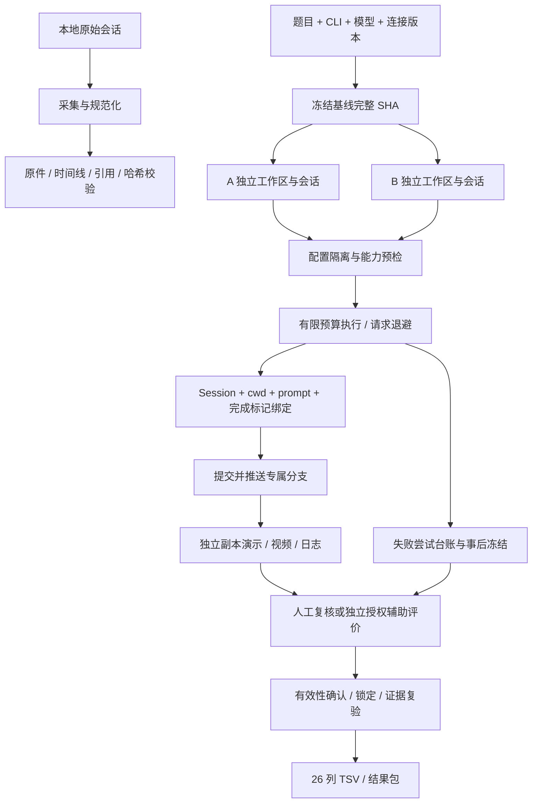

# 完整版本逻辑 / Architecture

版本 0.5.0 包含轨迹采集与 Pair 执行两条入口，共用原件保留、身份绑定和完整性验证原则。

## 采集与浏览

CLI 负责选择会话、读取原始字节、解析适配器事件、生成 bundle 和独立验证。`raw/` 保存原件，`trajectory/` 保存规范化事件，`evidence/` 回指原文件行号，`annotation/` 保存标注模板。HTML 时间线可离线浏览；可重建的 corpus 索引不替代原件。

## Pair 冻结与执行

- `desk.py` 提供回环 HTTP 页面/API，`desk_store.py` 原子保存任务和设置，`runner.py` 管理队列、运行名额、尝试、超时和中止。
- `baseline.py` 与 `workspace.py` 处理 GitHub commit / 新建 / 本地基线。任务冻结完整 SHA；A/B、干净重跑统一使用该 SHA，并记录 `initial_sha`。本地基线必须是独立 clone；共享 `.git` 的 linked worktree 会被拒绝，避免修改原仓库；本地复制模式的 tracked submodule 也明确拒绝，可改用 GitHub commit 模式。
- `engines.py` 构建 CLI 参数、识别提示词/模型/轮次及完成状态。Codex 同时保存事件流和对应原始 rollout，不能用另一个旧会话补足证据。
- `cli_config.py` 保存连接版本、保护 Key；`run_policy.py` 创建 Pair 独立 CLI 配置，只迁移允许的认证/provider/model 字段，预检并禁用额外 Agent/扩展能力。
- `codex_relay.py` 在响应尚未交付时进行有限请求重试；开始交付后不重放。认证、余额和未知错误保留失败状态。`procmon.py` / Windows Job Object 处理所属进程的监控和清理。

## 失败、重跑与演示

每次尝试保留事件流、原件副本、退出码、会话 ID、策略收据和错误；手动干净重跑保留旧工作区及历史评审，重新绑定新证据。恢复策略有明确配置与持久化预算，不能用重启无限延长预算或隐去额外轮次。

`failed_capture.py` 将失败侧的当前文件与轨迹冻结为事后快照，逐项核验来源和哈希；不会把失败重新标成生成成功。`demo.py` / `demo_artifacts.py` / `demo_terminal.py` 从固定提交或已验证失败快照创建独立演示目录。真实命令、可见 Chromium、FFmpeg X11 录像分别留日志与状态，录制最多 89 秒；阅读展示不完整时如实报告。

## 评审与导出

`compliance.py` 读取完整原轨迹并区分 clear / issue / needs_review / not_verified；真实异步派发即使没有最终子报告仍是派发。`checklist.py` 核验基线、会话、模型、产物、视频和评审字段；已锁定评价绑定证据哈希，严格导出重新读取原件。

默认人工评审。`batch_pipeline.py`、`local_review_relay.py` 与 `local_review_worker.py` 提供显式授权的辅助评价，保留 AI 来源和独立有限预算；评分草稿不能代填人工有效性和无 AI 声明。独立模型须由管理员私有授权登记，Windows worker 还须提供私有批次/SSH 配置，导入模块本身不产生授权。该批处理工具目前专用于完整 **20 任务**收据，并要求生成模型 `auto_model/urm`；不是任意规模/模型的通用批处理入口。

`export_tsv.py` 保留 26 列顺序。人工模板字段由用户掌握；只有显式 AI 辅助流程才添加其来源，不能把辅助结果冒充人工独立评价。

## 信任边界

浏览器/API、relay 和桌面服务使用回环监听；部署通过 SSH 转发。A/B 配置、分支和会话独立，但仍可能共享操作系统账号、网络与文件访问权限。现有保护不能承诺阻断任意脚本间接调用外部模型。真实供应商可用性、OS 隔离和人工产品验收需各自验证。
